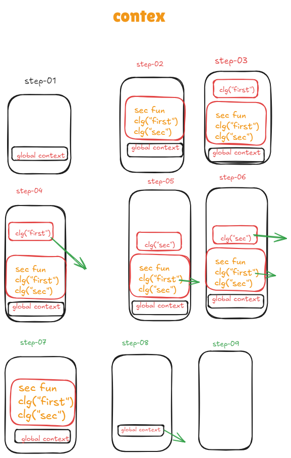

                        Javascript
                       Assignment-8
1.Write short notes on the below with code examples
- while loop
   - The while loop loops through a block of code as long as a specified condition is true.
      - Syntax
                while (condition) {
                // code block to be executed
                }


```js
                let i=1
                while(i<5){
                    console.log(i)
                    i++
                }
```
- do-while loop
    - The do while loop is a variant of the while loop. This loop will execute the code block once, before checking if the condition is true, then it will repeat the loop as long as the condition is true.
     - Syntax

            do {
            // code block to be executed
            }
            while (condition);
```js
                let i=10
                do{
                    console.log(i)
                    i++
                }while(i<5)
```
- for loop
  - A for loop in JavaScript repeatedly executes a block of code as long as a specified condition is true. It includes initialization, condition checking, and iteration steps, making it efficient for controlled, repetitive tasks.
```js
                let arr=["one","two","three"]
                for(let i of arr){
                    console.log(i)
                }
```
for in loop
  - The JavaScript for-in loop iterates over the enumerable properties of an object, allowing you to access each key or property name in turn. It's commonly used to traverse object properties but can also be used with arrays.
  ```js
          let obj={
              in:"linkedIn",
              ig:"instagram",
              fb:"facebook",
              yt:"youTube"
          }
          for(let i in obj){
              console.log(obj[i])
          }

  ```
- for of loop
      - The JavaScript for of statement loops through the values of an iterable object.It lets you loop over iterable data structures such as Arrays, Strings, Maps, NodeLists, and more:
```js
            let  arr=["one","two","three","four"]
            for(let i of arr){
                console.log(i)
            }
```
- Explain the scope in Javascript.
    - Scope determines the accessibility (visibility) of variables. JavaScript variables have 3 types of scope:
              -  Block scope
              - Function scope
              - Global scope. Block Scope.
- What is a callback?
    - call back function  is the function that are passed inside another function as an argument
    ```js
                        let arr=[1,2,3,4,5,6,7]
                    let newArr=arr.filter((item)=>{
                        return item > 5
                    })
                    console.log(newArr)
    ```
- Explain context in JavaScript
    -   
- What is hoisting in JavaScript?
  - Hoisting is a JavaScript mechanism where variables and function declarations are moved to the top of their scope before code execution.
- Explain lexical scope
   - JavaScript uses lexical scoping to resolve the variable names when a function is created inside another function. It determines the function's parent scope by looking at where the function was created instead of where it was invoked.
- What is scope chaining?
   - Scope Chain means that one variable has a scope (it may be global or local/function or block scope) is used by another variable or function having another scope (may be global or local/function or block scope). This complete chain formation goes on and stops when the user wishes to stop it according to the requirement.
   ```js
                let firstFunction =()=>{
                    let firstName="Zareel"
                    let secondFunction =()=>{
                        (firstName)
                        let lastName="kalam"
                        let thirdFunction=()=>{
                            console.log(firstName+lastName)
                        }
                        thirdFunction()
                    }
                    secondFunction()
                }
                firstFunction()
    ```
- Explain closure.
  - A closure is the combination of a function bundled together (enclosed) with references to its surrounding state (the lexical environment).
- What is the difference between undefined and not defined in javascript?
      - A variable that has been declared but not assigned a value is undefined . A variable that has not been declared at all is not defined      
- Explain spread and rest operator
  - The JavaScript spread operator ( ... ) allows us to quickly copy all or part of an existing array or object into another array or object
  ```js
            let myFun=(a,b,...rest)=>{
                console.log(rest)
            }
            myFun(1,2,3,4,5,6)
   ```
   -  The rest parameter syntax allows a function to accept an indefinite number of arguments as an array, providing a way to represent variadic 
   ```js
                function fun(a, b){
                        return a + b;
                    }
                    console.log(fun(1, 2)); 
                    console.log(fun(1, 2, 3, 4, 5));
    ```
- Explain ‘this’ keyword in Javascript.
   -The this keyword refers to the context where a piece of code, such as a function's body, is supposed to run. Most typically, it is used in object methods, where this refers to the object that the method is attached to, thus allowing the same method to be reused on different objects
   ```js 
                let user={
                    firstName:"zareel",
                    lastName:"kalam",
                    courseCount:7,
                    role:"admin",
                    sayRole:function(){
                        return this.role
                    }
                }
                console.log(user.sayRole())
```
